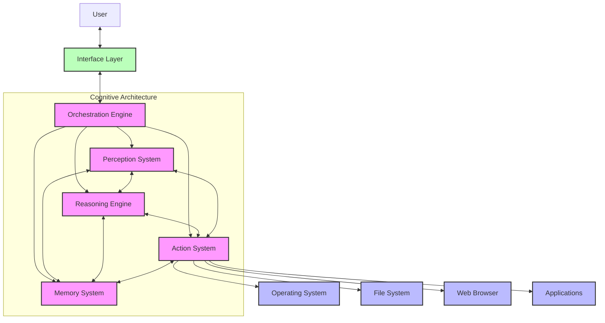

# ORAMA System

## Autonomous LLM Agent Architecture

ORAMA is a self-directed AI operator leveraging local Large Language Models to achieve autonomous system operation on Windows 11. The architecture implements a cognitive framework that perceives, reasons, acts, and remembers—enabling genuine understanding and interaction with computing environments beyond traditional automation.

### Core Capabilities

- **Persistent Memory:** Multi-tiered knowledge architecture combining vector embeddings, knowledge graphs, and document storage
- **System Access:** Full operating system integration with secure command execution and file system manipulation
- **User Input Simulation:** Advanced computer vision and input generation for natural interface interaction
- **Web Browsing:** Browser automation with content processing and information extraction
- **Cognitive Reasoning:** Local LLM inference with sophisticated planning and verification loops

## System Architecture



## System Components

### Core System Files

|File|Description|
|---|---|
|**main.py**|System entry point implementing the event loop, subsystem initialization, and core orchestration.|
|**config.yaml**|Unified configuration controlling all parameters across perception, reasoning, action, and memory subsystems.|
|**core_engine.py**|Cognitive architecture integrating LLM inference, computer vision, and planning capabilities into a unified reasoning system.|
|**action_system.py**|Implementation of system interaction capabilities through command execution, input simulation, and browser automation.|
|**memory_engine.py**|Multi-tiered persistent memory system combining vector databases, knowledge graphs, and document storage with optimization mechanisms.|
|**orchestrator.py**|Event-driven coordination engine implementing task scheduling, verification loops, and resource management.|
|**interface.py**|User interaction layer providing command processing, status reporting, and natural language understanding.|
|**system_utils.py**|Utility framework implementing system monitoring, security enforcement, and performance analytics.|

### Support Files

|File|Description|
|---|---|
|**requirements.txt**|Package dependencies with version specifications for reproductible environment setup.|
|**LICENSE**|Project licensing information and terms of use.|

### Data Directories

|Directory|Purpose|
|---|---|
|**data/vector_store/**|Storage for semantic embeddings and similarity search indices.|
|**data/knowledge_graph/**|Entity-relationship data store implementing causal networks and concept hierarchies.|
|**data/documents/**|Document repository for files, media assets, and structured records.|
|**data/parameters/**|Configuration state, learned parameters, and user preferences storage.|

## Implementation Technologies

ORAMA leverages cutting-edge technologies to achieve its autonomous capabilities:

- **LLM Infrastructure:** Ollama runtime with GGUF quantized models (DeepSeek Coder 7B or Gemma 2B)
- **Perception System:** OpenCV with YOLOv9-mini detection models and TesseractOCR
- **Memory Architecture:** LanceDB vector database and SQLite with graph extensions
- **Action Generation:** PyAutoGUI with Win32API integration and Playwright browser automation
- **Orchestration:** AsyncIO-based event processing with priority-aware task scheduling

## Technical Workflow

The ORAMA system operates through these core processing loops:

1. **Perception-Action Cycle:**
    
    - Screen state analysis and system monitoring detect relevant events
    - Reasoning engine evaluates current state against goals
    - Action generation executes planned operations
    - Perception verifies results and updates state models
2. **Recursive Planning:**
    
    - High-level goals decomposed into sub-goals through LLM reasoning
    - Sub-goals further broken down to atomic actions
    - Execution proceeds with verification at each level
    - Failures trigger re-planning at appropriate level
3. **Memory Operations:**
    
    - Current task context determines memory retrieval patterns
    - Relevant information surfaces based on semantic similarity
    - New experiences encoded across multiple memory systems
    - Periodic consolidation optimizes knowledge structures

## Getting Started

### Prerequisites

- Windows 11 (Build 22621 or higher)
- Python 3.11+ with required packages
- Ollama installed with compatible GGUF models
- Minimum hardware: 10GB RAM, 6-core CPU, 4GB VRAM GPU
- Recommended: 12GB RAM, 8-core CPU, 6+GB VRAM GPU

### Installation

1. Clone the repository:
    
    ```
    git clone https://github.com/your-username/orama.git
    cd orama
    ```
    
2. Install dependencies:
    
    ```
    pip install -r requirements.txt
    ```
    
3. Configure Ollama with appropriate models:
    
    ```
    ollama pull deepseek-coder-7b-instruct:Q5_K_M
    ollama pull gemma-2b-instruct:Q5_K_M
    ```
    
4. Update configuration:
    
    ```
    # Edit config.yaml to match your system capabilities and preferences
    ```
    
5. Run the system:
    
    ```
    python main.py
    ```
    

## Development Roadmap

ORAMA follows a four-phase implementation approach:

1. **Foundation Phase (Weeks 1-4):** Infrastructure setup, core subsystem implementation
2. **Core Capabilities (Weeks 5-8):** Perception, action, memory, and reasoning integration
3. **Advanced Features (Weeks 9-12):** Complex reasoning, advanced memory, sophisticated planning
4. **Optimization (Weeks 13-16):** Performance tuning, resource optimization, security hardening

## Security Considerations

The ORAMA system operates with full system access and therefore includes several security measures:

- Permission boundaries for system operations
- Comprehensive audit logging
- Risk assessment for operations
- User approval workflows for high-risk actions

**Note:** This implementation prioritizes capability over security isolation, making it suitable for development environments but requiring appropriate isolation in production deployments.

## License

This project is licensed under the MIT License - see the LICENSE file for details.